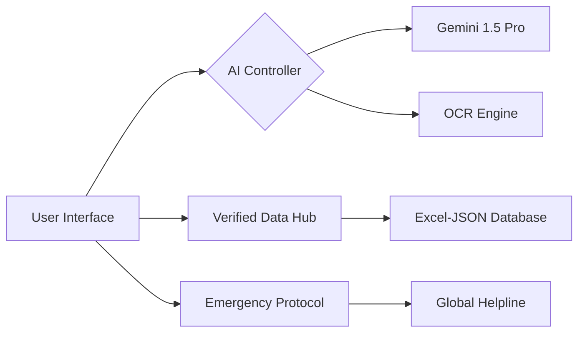

# 🏥 HealAi: The Ultimate AI-Powered Healthcare Ecosystem

[](https://github.com/sudoSubh/HealAi)
[](https://ai.google.dev/)
[](https://framer.com/motion)

HealAi isn't just a chatbot; it's a **Healthcare Command Center**. We've combined cutting-edge Generative AI with localized, verified data to bring professional-grade medical guidance to your pocket.

---

## 💎 Groundbreaking Features

### 1. 🤖 Context-Aware AI Medical Assistant
Our flagship AI bot is designed to be your first point of contact for any health query.
- **Multilingual Mastery**: Fluently communicates in **50+ languages** (Hindi, Bengali, Odia, Spanish, etc.) to ensure no one is left behind.
- **Safety First**: Implements a rigorous medical context layer to ensure advice is empathetic yet anchored in safety protocols.
- **Seamless Typing Simulation**: A premium UI experience that mimics a real conversation with a health professional.

### 2. 🩺 Intelligence-Driven Symptom Checker
A sophisticated diagnostic tool that goes beyond keyword matching.
- **Urgency Classification**: Categorizes symptoms into *Emergency*, *Urgent*, or *Routine* with clear reasoning.
- **Condition Matching**: Uses Gemini's logical reasoning to provide "Probability Matches" for potential conditions.
- **Holistic Analysis**: Provides **Lifestyle Impact** analysis, identifying how your condition affects sleep, diet, and activity.
- **Personalized Remedies**: Offers safe, non-prescription home remedies alongside critical "Red Flag" warnings.

### 3. 📄 OCR Medical Report Intelligence
Stop googling laboratory values. Our system deciphers them for you.
- **Vision AI Extraction**: Upload images or PDFs of lab reports. The system extracts keys metrics (Hemoglobin, Glucose, etc.).
- **Jargon Translation**: Converts complex medical terms into "Plain English" patient-friendly summaries.
- **Visual Insights**: Generates a health dashboard from your report data to track trends over time.

### 4. 🏥 Verified Healthcare Hub (The "AirBnb" of Clinics)
We've replaced flaky, unreliable APIs with a **Verified Regional Database**.
- **100% Reliable Data**: Powered by a curated Excel-verified dataset for Bhubaneswar and beyond.
- **No-SDK Map Experience**: High-performance UI that routes directions directly to your device's native Google Maps app—zero "Oops something went wrong" errors.
- **Trust Badges**: Only verified facilities receive the "Verified Data" badge, ensuring user safety.

### 5. 🎓 Health Education & Community Hub
Prevention is better than cure. HealAi keeps you informed.
- **Curated Content**: Access to specialist-written articles on Heart Health, Nutrition, and Mental Wellness.
- **Interactive Webinars**: A dedicated space for live and recorded health sessions.
- **Fitness Integration**: Premium video resources for physical well-being.

### 6. 🚨 One-Tap Emergency Protocol
Seconds matter in a crisis.
- **Global Emergency CTA**: A persistent, one-tap button to call the **National Helpline (112)**.
- **Instant Direction Routing**: One tap to get the fastest route to the nearest verified Emergency Room.

---

## 🛠️ The Technical Powerhouse

### **The Stack**
- **Frontend**: React 18 / Vite / TypeScript
- **Styling**: Tailwind CSS / CSS Modules
- **Animation**: Framer Motion (60FPS smoothness)
- **AI Core**: Google Gemini 1.5 Pro (JSON-mode integration)
- **Data Persistence**: Supabase & Local Verified JSON

### **System Architecture**


---

## ⚙️ Development & Deployment

### Environment Setup
HealAi requires a dual-key configuration for maximum reliability.

**Frontend (`/frontend/.env`):**
```env
VITE_GEMINI_API_KEY=your_gemini_key
VITE_SUPABASE_URL=your_project_url
VITE_SUPABASE_ANON_KEY=your_key
```

**Backend (`/backend/.env`):**
```env
PORT=3000
GEMINI_API_KEY=your_gemini_key
GOOGLE_MAPS_API_KEY=your_key
```

### Quick Start
1. `cd backend && npm install && npm run dev`
2. `cd frontend && npm install && npm run dev`

---

## 👨‍💻 Submission Context
Built for the **2024 AI Hackathon**, HealAi represents a shift from "AI for Fun" to "AI for Life". Our focus was on **reliability, accessibility, and the human touch**.

*Disclaimer: HealAi is an educational tool. In a medical emergency, always consult a licensed doctor or call emergency services immediately.*